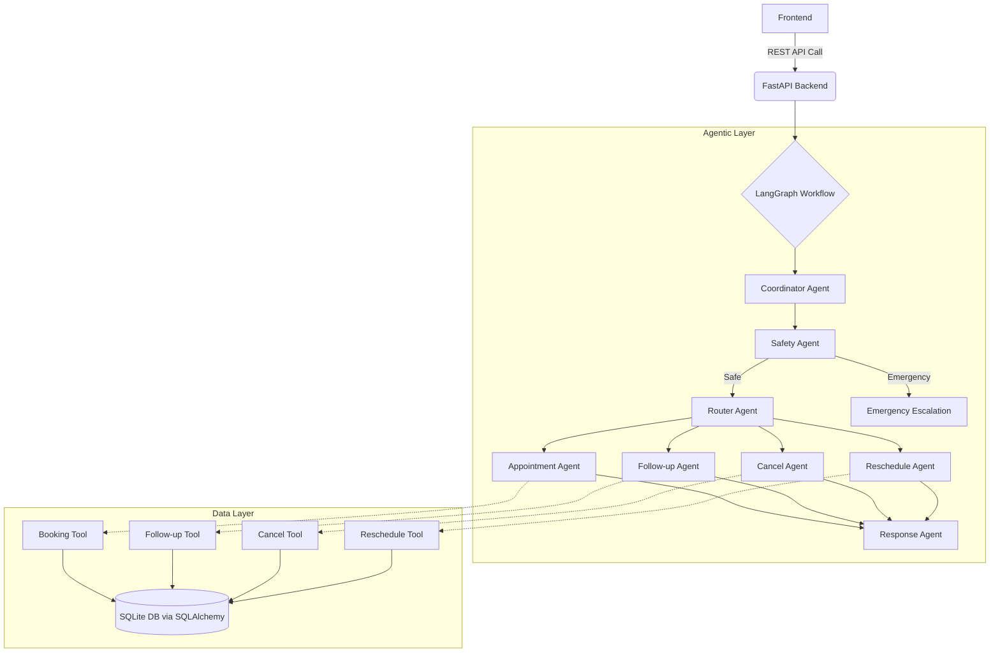
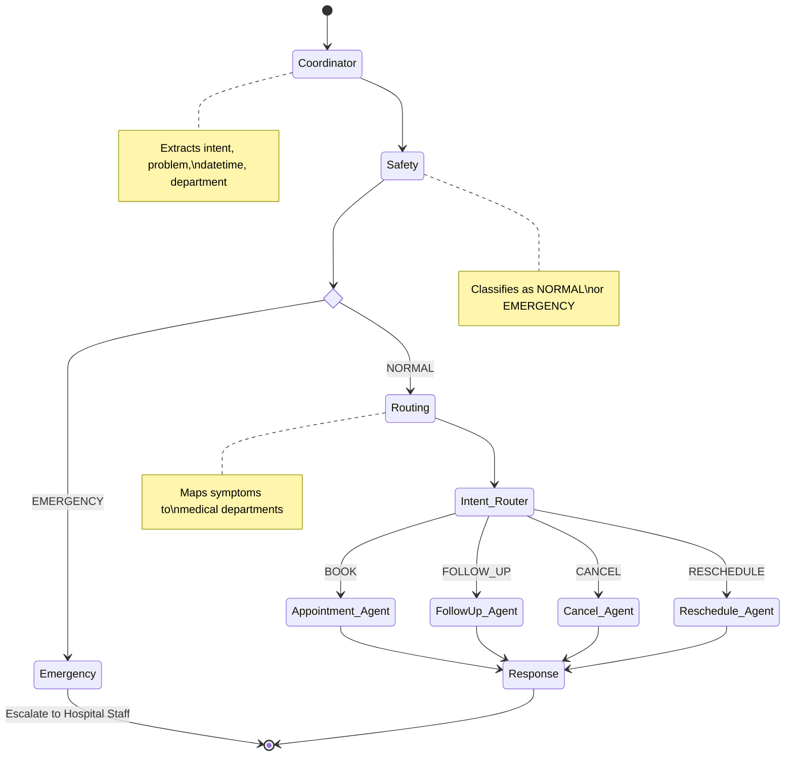

# Clinico (AgentCare) - Agentic AI Hospital Administration System

## 🏥 Overview

Clinico is an **Agentic AI-powered Hospital Administration Assistant** designed to automate administrative workflows while ensuring all medical decisions remain strictly under human supervision. 

**Safety First:**
- ❌ **Does NOT** diagnose diseases.
- ❌ **Does NOT** prescribe medicines.
- ❌ **Does NOT** replace clinicians.
- ✅ **DOES** automate hospital operations (booking, routing, cancellation, rescheduling, and emergency escalation).

## 🚀 Features

- **Intelligent Appointment Booking**: Understands natural language to book appointments.
- **Department Routing**: Automatically routes symptoms to the correct department (e.g., "Tooth pain" ➔ Dentistry).
- **Safety & Emergency Escalation**: Intercepts potential medical emergencies and halts the automated booking workflow to suggest immediate human/medical intervention.
- **Rescheduling & Cancellations**: Seamlessly handles modifications to existing appointments.
- **Follow-up Scheduling**: Books follow-up appointments with previously visited doctors.
- **Audit Logging & Metadata Management**: Tracks workflow and manages medical document metadata.

## 🛠️ Technology Stack

- **Backend**: Python 3.12+, FastAPI
- **Agent Framework**: LangGraph, LangChain
- **LLM**: OpenAI / Gemini / Groq
- **Database**: SQLite, SQLAlchemy ORM
- **Authentication**: JWT

## 🏗️ Architecture

Below is the high-level architecture of Clinico, demonstrating how user requests travel through the REST API, into the LangGraph workflow, and interact with the database via specialized tools.



## 🤖 Agentic Workflow Details

The system employs a multi-agent architecture where a single shared `AgentState` is passed from node to node. Each agent has a strictly defined responsibility.



### Key Agents

1. **Coordinator Agent**: The workflow orchestrator. Extracts intent, time, department, and doctor from the patient's message.
2. **Safety Agent**: Protects healthcare safety. Halts the workflow if symptoms (e.g., chest pain, severe bleeding) indicate an emergency.
3. **Routing Agent**: Administrative department routing. Maps symptoms to departments (e.g., "Knee pain" ➔ Orthopedics).
4. **Action Agents (Appointment, Follow-up, Cancel, Reschedule)**: Utilize specific database tools to validate and execute the requested administrative action.
5. **Response Agent**: Translates the structured workflow results into a warm, user-friendly, plain-language response.

## 🗄️ Database Schema

Clinico uses a relational SQLite database (`clinico.db`). Core entities include:
- **Patients**: Profile and contact info.
- **Departments**: Cardiology, Dermatology, Orthopedics, etc.
- **Doctors**: Specialization, working hours, fee, experience.
- **DoctorWorkingDay**: Schedule availability.
- **Appointments**: Core transaction table tracking `patient_id`, `doctor_id`, `datetime`, and `status` (BOOKED, CANCELLED, RESCHEDULED, COMPLETED).

## 🏁 Getting Started

1. **Environment Setup**: 
   Copy `.env.example` to `.env` and fill in your API keys (e.g., `GROQ_API_KEY`, `JWT_SECRET_KEY`).
2. **Install Dependencies**:
   ```bash
   pip install -r requirements.txt
   ```
3. **Seed Database**:
   Run the seed script to generate dummy hospital data (departments, doctors, synthetic patients).
   ```bash
   python seed.py
   ```
4. **Run Server**:
   Start the FastAPI application.
   ```bash
   fastapi dev main.py
   ```

## 🔒 Safety Boundary Disclaimer
This system MUST NEVER diagnose diseases, recommend medicines, suggest dosage, replace clinicians, or interpret medical reports. It is strictly an administrative facilitation tool.
