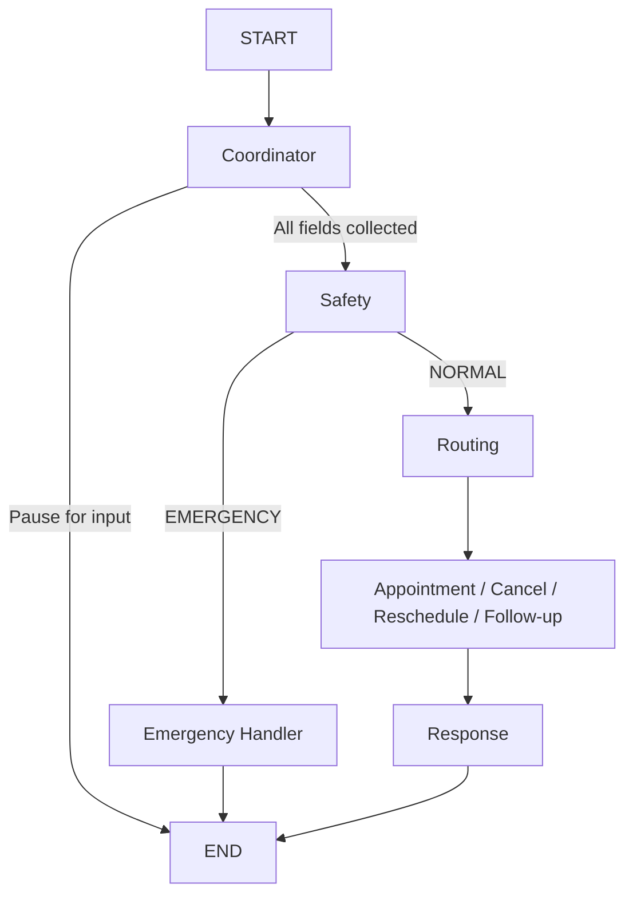

# AgentCare - AI Healthcare Administration System

AgentCare is a modern, AI-powered healthcare administration system designed to handle patient inquiries, appointment booking, rescheduling, cancellations, and document uploads. 

## 🏥 Problem Statement
Administrative burdens in healthcare are massive. Call centers are overwhelmed, patients wait on hold for simple tasks, and medical staff spend too much time on data entry. AgentCare solves this by providing a conversational AI assistant that directly hooks into the hospital's database, handling common patient needs autonomously with zero wait times.

## 🤖 Why Multi-Agent Architecture?
A single LLM prompt cannot handle the complex safety checks, specialized routing, database interactions, and state tracking required for a hospital system. We use a **Multi-Agent Architecture** (via LangGraph) to divide responsibilities:
1. **Coordinator Agent**: Interacts with the user, handles small talk, and collects necessary fields.
2. **Safety Agent**: Checks if the query is a medical emergency and escalates immediately without diagnosing.
3. **Routing Agent**: Maps the patient's symptoms to the correct hospital department.
4. **Specialized Action Agents**: Dedicated agents for Booking, Canceling, Rescheduling, and Follow-ups with explicit database tools.

## 🛠️ Tech Stack
- **Backend:** FastAPI, LangGraph, LangChain, SQLAlchemy, SQLite
- **Frontend:** React, Vite, TailwindCSS, React Router
- **LLMs:** Groq, Gemini, Hugging Face
- **Observability:** LangSmith (Agent Tracing), Pydantic Logfire (Application Logging)
- **Deployment:** Docker, Render

---

## 📂 Project Structure

- `/backend` - The FastAPI backend.
  - `/agents` - LangChain agents and the LangGraph workflow (`graph.py`).
  - `/api` - FastAPI routers (`chat.py`, `appointments.py`).
  - `/auth` - JWT authentication logic and dependencies.
  - `/database` - SQLAlchemy config and DB session logic.
  - `/models` - Pydantic data models and SQLAlchemy ORM models.
  - `/tools` - Tools used by the Action Agents to interact with the database.
  - `/session` - Session ownership tracking for multi-turn chats.
- `/frontend-react` - The Vite React frontend.
  - `/src/components` - Reusable UI components (Navbar, ChatMessage).
  - `/src/contexts` - React context for Auth state.
  - `/src/pages` - Application pages (Dashboard, Chat, Login, etc.).
  - `/src/hooks` - Custom hooks like `useChat.js`.
- `main.py` - The FastAPI application entrypoint (serves both API and static frontend assets).
- `Dockerfile` - Multi-stage build for deploying the full stack.
- `render.yaml` - Infrastructure-as-Code for Render deployment.

---

## 🔀 Multi-Agent Workflow



---

## 🗄️ Database Schema

The system uses SQLite (via SQLAlchemy) with the following core tables:
- **users**: Authentication data (email, password hash).
- **patients**: Patient profiles linked to users.
- **doctors**: Hospital staff.
- **departments**: Hospital departments (Cardiology, General Practice, etc.).
- **appointments**: Booked slots linking patients to doctors.
- **medical_documents**: Records of uploaded files.

---

## 🔌 APIs

- `POST /auth/signup` - Register a new user/patient.
- `POST /auth/login` - Authenticate and receive a JWT.
- `GET /auth/me` - Get current user profile.
- `POST /chat/session/start` - Start a guided multi-turn chat session.
- `POST /chat/session/reply` - Send a message to an active chat session.
- `GET /appointments/history` - Fetch a patient's appointment history.

---

## 💻 Frontend Pages

- **Landing Page (`/`)**: Marketing and entry point.
- **Login/Register (`/login`, `/register`)**: Authentication.
- **Dashboard (`/dashboard`)**: The main hub with quick action buttons (Book, Reschedule, etc.).
- **Chat (`/chat`)**: The conversational UI interfacing with the LangGraph backend.
- **History (`/history`)**: Table view of past and upcoming appointments.
- **Documents (`/documents`)**: View and upload medical records.

---

## 🚀 Installation & Local Run

### Environment Variables
Copy `.env.example` to `.env` and fill in your keys:
```bash
cp .env.example .env
```

### Backend (Python)
We recommend using `uv` for lightning-fast dependency management:
```bash
uv pip install -r requirements.txt
uvicorn main:app --reload
```

### Frontend (React)
```bash
cd frontend-react
npm install
npm run dev
```

---

## 🐳 Docker Deployment

To build and run the entire stack in a single container:
```bash
docker build -t agentcare .
docker run -p 8000:8000 --env-file .env agentcare
```

---

## ☁️ Render Deployment

The project includes a `render.yaml` file for 1-click deployment on Render.
1. Connect your repository to Render.
2. Select **Blueprint** deployment.
3. Render will automatically provision:
   - A Web Service built from the `Dockerfile`.
   - A **Persistent Disk** mounted at `/data` for the SQLite database and LangGraph state.
4. Set your Environment Variables in the Render Dashboard (API keys, Logfire token).

---

## 🔮 Future Improvements
- **Migrate to PostgreSQL**: The SQLAlchemy ORM makes migrating to Postgres trivial for massive scale. Just change the `DATABASE_URL` env var.
- **Voice Integration**: Add WebRTC or Whisper to allow patients to speak instead of type.
- **FHIR Integration**: Sync the local database with standard hospital EMR systems using FHIR formats.
